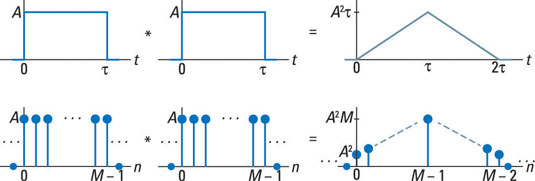
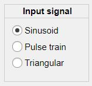
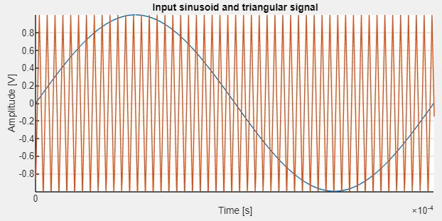

# Class-D Amplifier Simulator with any Matlab Toolbox

## 1. Introduction
The objective of this repository is to make and show a system that simulates a Class-D amplifier in a program without a Matlab Toolbox.

A class-D Amplifier or a switching amplifier is an electronic amplifier in which the amplifying devices operate as electronic switches, and not as linear gain devices as in other amplifiers. They operate by rapidly switching back and forth between the supply rails, being fed by a modulator using pulse width to encode the audio input into a pulse train. The audio escapes through a simple low-pass filter into the loudspeaker. The high-frequency pulses are blocked. Since the pairs of output transistors are never conducting at the same time, there is no other path for current flow apart from the low-pass filter/loudspeaker. For this reason, efficiency can exceed 90%.

Class-D amplifiers work by generating a train of rectangular pulses of fixed amplitude but varying width and separation, or varying number per unit time, representing the amplitude variations of the analog audio input signal.  The output of the modulator is then used to gate the output transistors on and off alternately. Great care is taken to ensure that the pair of transistors are never allowed to conduct together, as this would cause a short circuit between the supply rails through the transistors. A simple low-pass filter consisting of an inductor and a capacitor provides a path for the low frequencies of the audio signal, leaving the high-frequency pulses behind. The circuit then relies on the inductance of the loudspeaker to keep the HF component from heating up the voice coil.

So, we will divide the program into the following blocks or sections:

  
  
## 2. Code

### 2.1. Triangular Signal Generator (triangular.m)
As I have said before, one important point of this project is to do not use Matlab Toolboxes. We could use the sawtooth function, but is included in the Signal Procesing Toolbox. So, consequently, I will use the convolution method (The convolution of two train pulses is a periodic triangular signal, as shown in the following figure). It is important to note that the frequency of the signal is choosen by the user.

  
  
### 2.2. Pulse Train Generator (pulseTrain.m)
A program that creates a pulse train with the timeHigh/timeLow, amplitude and frequency chosen by the user. The timeHigh parameter is the percentage of the time of one period in which the signal stays at the high level.
Besides having the possibility of the Pulse Train as the input signal, the user may have other posibilities such as the Triangular Signal or a Sinusoid Wave.

  
 
An example of the plot of the Triangular Signal and the Input:

  

### 2.3. Pulse Width Modulation (pwm.m)
This program makes the comparison between the Triangular Siganl and the Pulse Train obtaining the maximum value.

### 2.4. Amplification and Low-Pass Filter (Simulator.code)
The amplification made by the transistors is simulated by a simple constant. 

 
 

## References
[1] J. S. Chang, Meng-Tong Tan, Zhihong Cheng and Yit-Chow Tong, "Analysis and design of power efficient class D amplifier output stages," in IEEE Transactions on Circuits and Systems I: Fundamental Theory and Applications, vol. 47, no. 6, pp. 897-902, June 2000, doi: 10.1109/81.852942.
